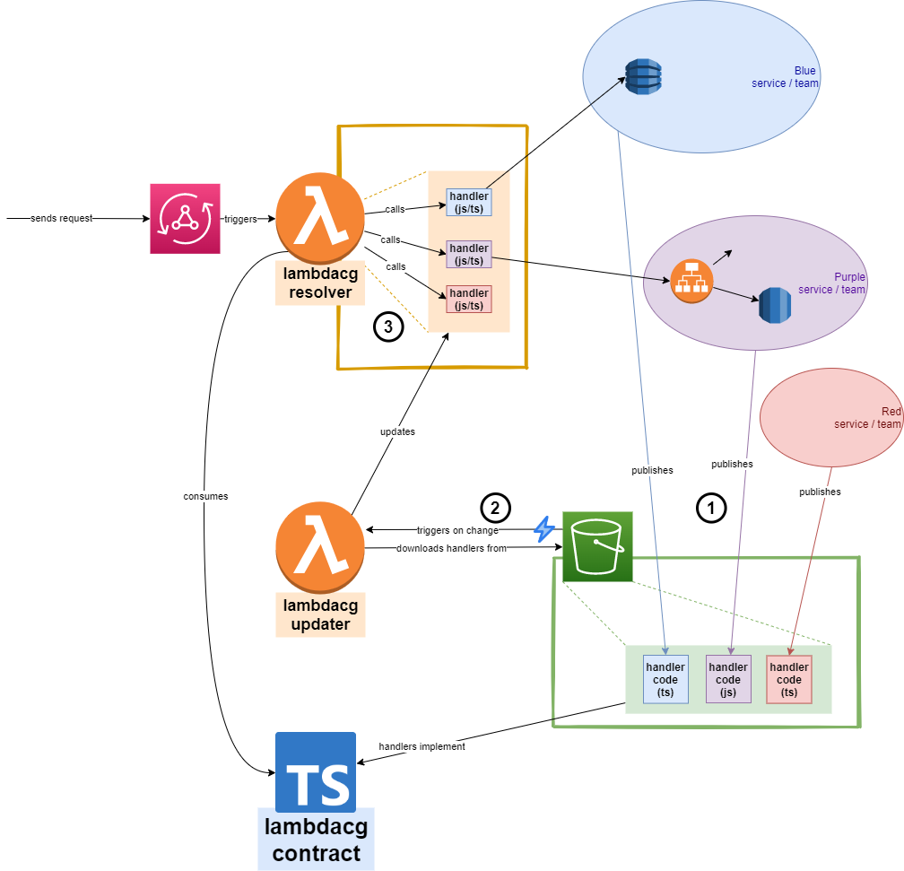

# Lambda Composition Gateway

Imagine multiple software development teams: one working on a frontend application, and several others working on (backend) services that supply the queries and commands that the frontend application uses. 

If the frontend were to invoke the services directly, this would mean a tight coupling between them; not only between frontend and backend, but possibly also 
between the backend services. Teams would need to communicate a lot, and from time to time they would depend on one of the other teams to implement part of new feature.

This repository contains the Lambda Composition Gateway (LambdaCG), a proof of concept that decouples software components like these. 

## Testing, building, running

Required tool: [nodejs (including npm)](https://nodejs.org/en/download/). 

Go to the repository root directory.

Before anything else:

    npm install

To build all the code:

    npm build

To run all the unit tests:

    npm test

This repository has a so-called *monorepo* setup, which means each of the three projects can also be independently built, tested and run.

Running is (for now) not possible. 

## Architecture

LambdaCG consists of three components:

- lambdacg-resolver
- lambdacg-updater
- lambdacg-contract

The following describes an example of how they could cooperate with 3 services.

 The pink thing on the left is an AWS AppSync instance in this case, but it could be anything that needs to delegate requests to specialized services.

There are 3 services, maintained by 3 teams: teams/services Blue, Purple and Red. Each of the services has the need to process (parts of) requests that arrive at the AppSync graphQL API. 

1. Each team/service publishes a *handler* for well-defined requests to an S3 bucket. Each of these handlers implement the contract defined by lambdacg-contract.

   Note that a handler could insert something into a database (Blue handler), or send a request to an API (Purple handler); it could also be just a bit of logic, that doesn't need any communication to any backend system (Red service).

2. The S3 bucket is configured to trigger the lambdacg-updater lambda. In response, that lambda downloads the published handlers, packages them and deploys them into the lambdacg-resolver.

3. The lambdacg-resolver has available all the handlers that were published by the services. It doesn't know where these handlers came from or what they do; it only knows that they all implement lambdacg-contract. Because of this, it knows how to invoke them and how to interpret their results, and combine them into a result that can be sent back through AppSync.

## Status

Status of this PoC is as follows:

* **lambdacg-contract**: done.
* **lambdacg-resolver**: Done. Code complete and unit tested
* **lambdacg-updater**: In progress
* **infrastructure**: Cloudformation templates to deploy the whole thing, not started yet.
