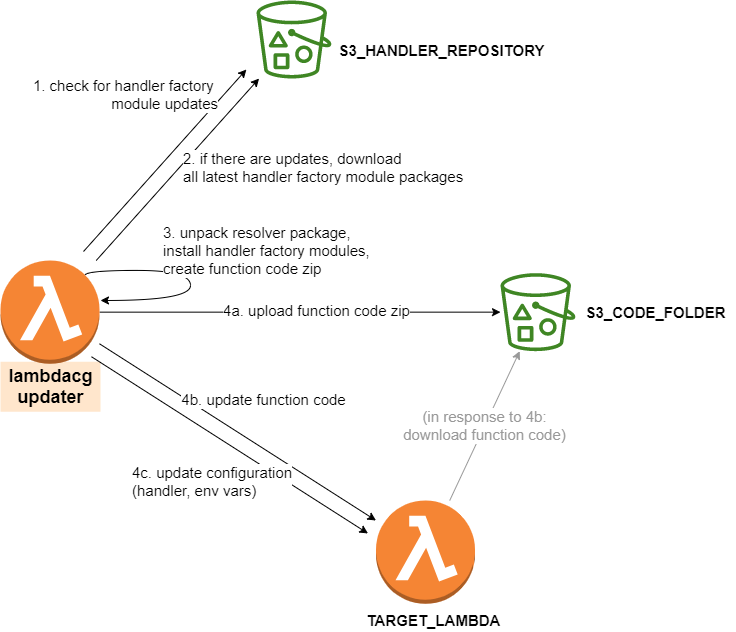
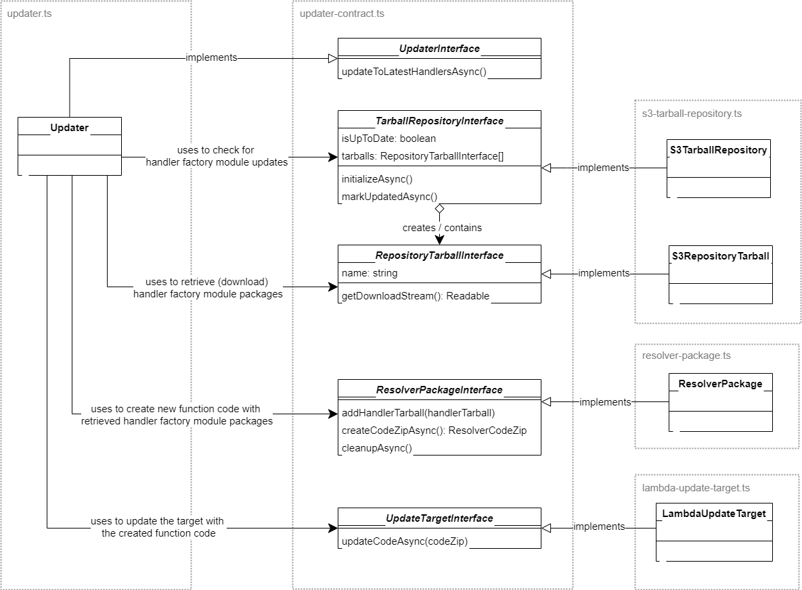

# lambdacg-updater

The Lambda Composition Gateway Updater (or "lambdacg-updater", or "updater") creates a zip package with code (node 14 compatible), and then uses that package to update a target lambda (on AWS). The updater itself is built to be run inside an AWS lambda function as well. 

## Testing and running

### Unit tests

Run the unit tests in `tests/*.test.ts`:

    npm test

### Component tests

Component tests run the updater component locally and let it communicate with real AWS infrastructure. See `tests/*.component-test.ts`. 

    npm run component-test

### Running manually

In order to run manually, you need to first set the following environment variables:

* `TARGET_LAMBDA`
* `S3_HANDLER_REPOSITORY`
* `S3_CODE_FOLDER`

(For the meaning of these environment variables, see [Overview, infrastructure](overview-infrastructure))

Then, invoke the `handleAsync` method in [src/index.ts](src/index.ts).

## Overview, infrastructure

We can give an overview through the infrastructure elements that play a role for the updater. 

* **lambdacg-updater**    
  The lambda that runs the code in this project. It can be invoked manually or in response to an event; it ignores any parameters supplied through the (required) AWS lambda request payload. When invoked, it will update *TARGET_LAMBDA* to the latest versions of handler factory modules in *S3_HANDLER_REPOSITORY*.

* **S3_HANDLER_REPOSITORY**    
  An S3 location (`s3://[bucket]/[prefix]/`), where the list of *handler factory modules* is stored. New modules, newly uploaded versions with the same name as an existing module, and removals are all detected and propagated to *TARGET_LAMBDA*. 
  
  For this to work correctly, S3 bucket versioning must be turned on on the S3 bucket.         

  A *handler factory module* is an NPM package (tarball) that implements `HandlerFactory` from [lambdacg-contract](../lambdacg-contract) and exports it as a default export.    

  The *S3_HANDLER_REPOSITORY* is set as an environment variable (with the same name) inside the *lambdacg-updater* lambda function. It should specify an S3 url of the bucket and prefix, and it should end in '/' (to be extra sure you are aware this is a prefix).

* **TARGET_LAMBDA**    
  The name of a target lambda to update the configuration and code of. It can be any lambda you like, but in practice we point it to the *lambdacg-resolver* lambda.    

  The *TARGET_LAMBDA* is set as an environment variable (with the same name) inside the *lambdacg-updater* lambda function. It should specify the name (or ARN) of a lambda to update. 

* **S3_CODE_FOLDER**    
  An S3 location (`s3://[bucket]/[prefix]/`), where the code for *TARGET_LAMBDA* is uploaded before the lambda function code is updated.

  The *S3_HANDLER_REPOSITORY* is set as an environment variable (with the same name) inside the *lambdacg-updater* lambda function. It should specify an S3 url of the bucket and prefix, and it should end in '/' (to be extra sure you are aware this is a prefix).

When the *updater-lambda* is invoked, the steps are as follows:

1. Check for updates with *S3_HANDLER_REPOSITORY*.
2. If there were updates, download the latest module versions.
3. Unpack the resolver package, install latest module versions into it and pack the resulting code into a zip.
4. Update the *TARGET_LAMBDA*:    
   (a) upload the function code zip to S3    
   (b) update the function code (which causes the function code zip to be downloaded into the lambda)    
   (c) update lambda function configuration to have the proper handler and environment variable settings.

## Logical design, code allocation

The logical design of the *lambda-updater* code is as in the following UML diagram.

The top level coponent is **Updater** (in `updater.ts`). It implements  **UpdaterInterface**'s only method, `updateToLatestHandlersAsync()`. 

**UpdaterInterface** is in `updater-contract.ts`, along with any interfaces of classes needed by the updater to be implemented:

1. **TarballRepositoryInterface** 
   Repository for (npm) tarballs; supports listing all (versions of) tarballs and checking wheterh there are any updates.    
   Implemented for S3 by **S3TarballRepository** in `s3-tarball-repository.ts`.
2. **RepositoryTarballInterface**    
   A tarball from a *TarballRepositoryInterface*. Supports downloading a tarball and getting its name.    
   Implemented for S3 by **S3RepositoryTarball** in `s3-tarball-repository.ts`.
3. **ResolverPackageInterface**    
   Supports all the operations that are needed on the resolver package, e.g. unpacking, installing handler factory modules, creating a zip stream.    
   Implemented by **ResolverPackage** in `resolver-package.ts`.
4. **UpdateTargetInterface**    
   Update target, supports all operations to update the target with the new code.    
   Implemented by **LambdaUpdateTarget** in `lambda-update-target.ts`.

These numbers (and the described components) correspond to those listed as steps in the execution at the end of the previous section.

## Relationship with `lambdacg-resolver`

No code is shared between `lambdacg-resolver` and `lambdacg-updater`; they are entirely independend projects.

However, at build/package time, the code of `lambdacg-resolver` is packaged into an assed for `lambdacg-updater` with name `resolver-package.tgz`. In order for the updater to be able perform updates with this package, the following contract is in place.

* Asset `resolver-package.tgz` must be a valid npm package
* If the contained `package.json` has an entry 'main' (pointing to the main entry point file), that is assumed to be the file that contains the lamba handler
* The exported lambda handler must have the name 'handler', and must conform to the [AWS lambda ways](https://docs.aws.amazon.com/lambda/latest/dg/nodejs-handler.html).
* The resolver package can assume that there is an environment variable `HANDLER_FACTORIES`, containing a string with comma-separated module names of handler factory modules.

